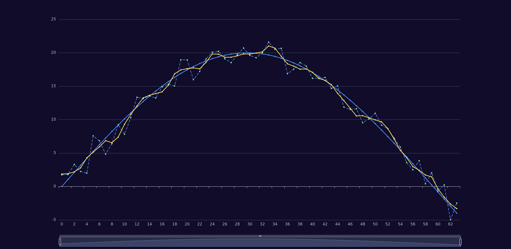

# savitzky–golay

Savitzky–Golay filter in Java.

Code ported from https://github.com/pconstantinou/savitzkygolay

Available at [Maven Central](https://mvnrepository.com/artifact/io.vacco.savitzky-golay/savitzky-golay).

```
dependencies {
  implementation("io.vacco.savitzky-golay:savitzky-golay:<LATEST_VERSION>")
}
```

This code is based on the article: [Smoothing and Differentiation of Data by Simplified Least Squares Procedures](http://dx.doi.org/10.1021/ac60214a047)

Provides an effective way of smoothing data that generally follows curves found
in polynomials.

It is particularly good alternative to a moving average since it does not
introduce a delay proportional to about half the window length.

The filter runs on `O(number of elements * size of window)`.

See test case for [usage example](./src/test/java/io/vacco/savitzkygolay/SgFilterTest.java).

Render plot in [eCharts](https://echarts.apache.org/examples/en/editor.html?c=line-simple).


